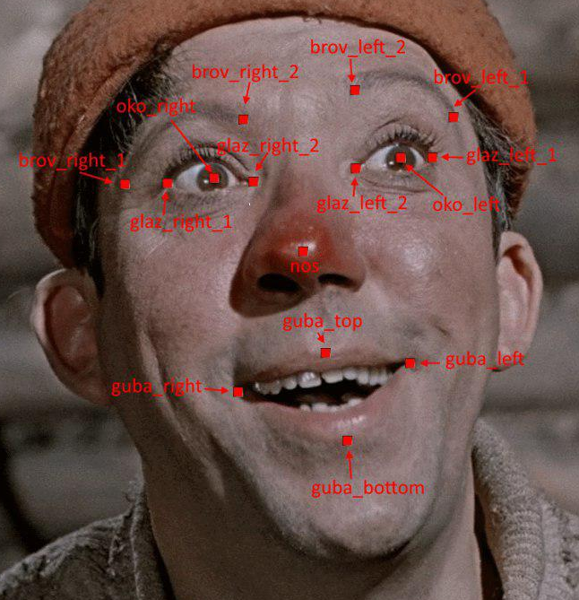

# Описание

Репозиторий содержит эталонную разметку ключевых точек рельефа лица.

Работа выполнена при поддержке РФФИ в рамках проекта 17-29-03370.

Лицензия: CC-BY-4.0G

## Данные

Оригинальные изображения принадлежат набору данных MegaFace (http://megaface.cs.washington.edu) и должны быть скакачаны самостоятельно.

Персоны | Значение
--- | --- 
Количество  | 1134
Список  | identity.lst

Фотографии | Значение
--- | --- 
Количество фотографий | 6518
Список фотографий | json.lst

## Описание данных

ортопрямоугольник зоны лица
* face

15 ключевых точек рельефа лица:
* brov_right_1
* brov_right_2
* oko_right
* oko_left
* brov_left_2
* brov_left_1
* glaz_right_1
* glaz_right_2
* glaz_left_2
* glaz_left_1
* nos
* guba_top
* guba_right
* guba_left
* guba_bottom

см. схему 